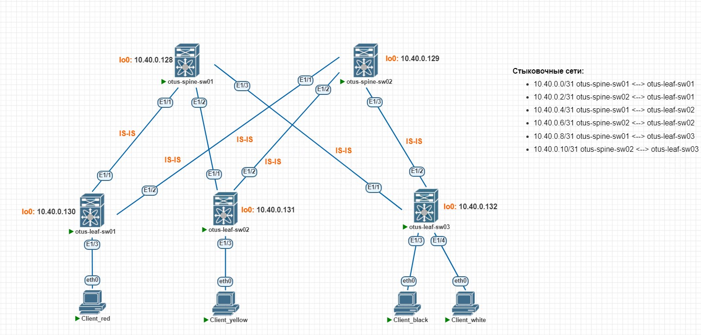
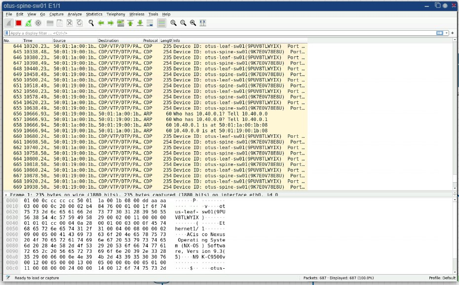
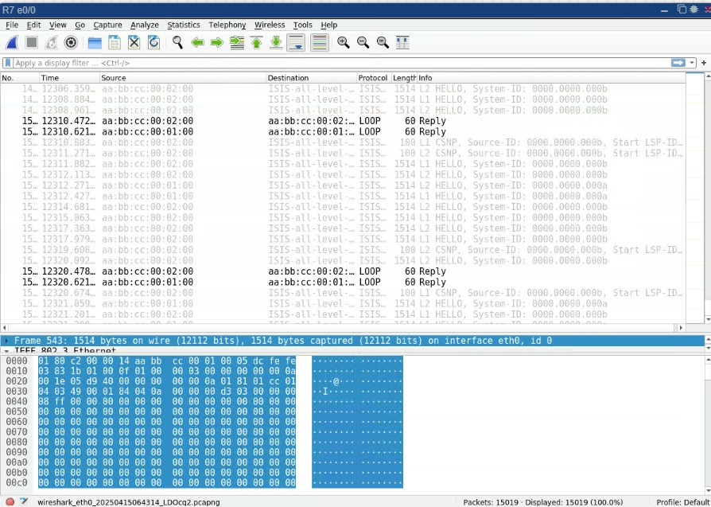
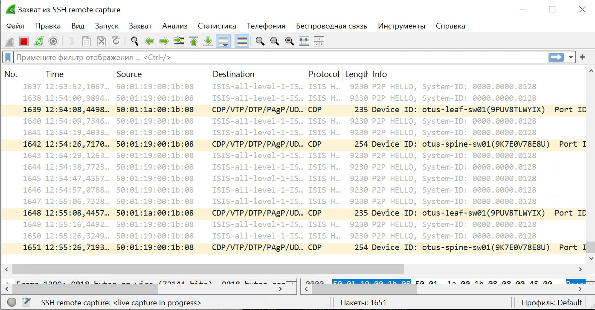

# Лабораторная работа №3. Построение Underlay. IS-IS
Задачи:
1. Настроить IS-IS в Underlay сети
2. Обеспечить доступность Loopback всех устройств
3. Зафиксировать в документации план работ, адресное пространство, схему сети, настройки
### Схема сети
Схема не изменена по сравнению с предыдущей работой.

### Адресация сети
Для loopback в лаборатной работе №1 была выделена сеть 10.40.0.128/25
|Address|Description|
|---|---|
|10.40.0.128/32| loopback otus-spine-sw01
|10.40.0.129/32| loopback otus-spine-sw02
|10.40.0.130/32| loopback otus-leaf-sw01
|10.40.0.131/32| loopback otus-leaf-sw02
|10.40.0.132/32| loopback otus-leaf-sw03
### Конфигурация
> Изначальная конфигурация взята из лабораторной работы №1. Добавлены и настроены loopback

#### Настройка IS-IS
**Глобальная настройка IS-IS**
Глобальная настройка включает в себя включение feature IS-IS (Cisco Nexus), запуск процесса IS-IS и назначение NET (аналог router-id) каждому устройству.
NET:
- AFI - оставляем 49, так как он изначально считается локальным значением
- Area ID - номер зоны. Будет 40
- System ID - для каждого устройства свой. Возьме последний октет у адреса loopback (например у spine - это .128)
- SEL - не трогаем, ставим 00

|Device|NET|
|---|---|
|49.0040.0000.0000.0128.00| otus-spine-sw01
|49.0040.0000.0000.0129.00| otus-spine-sw02
|49.0040.0000.0000.0130.00| otus-leaf-sw01
|49.0040.0000.0000.0131.00| otus-leaf-sw02
|49.0040.0000.0000.0132.00| otus-leaf-sw03

Также укажем L1 IS-IS в фабрике, так как нет нужды разделять на домены + это рекомендация Cisco.
Пример конфигурации с otus-leaf-sw01 (на остальном аналогично):
```
otus-leaf-sw01(config)# feature isis
otus-leaf-sw01(config)# router isis Underlay 
otus-leaf-sw01(config-router)# net 49.0040.0000.0000.0130.00
otus-leaf-sw01(config-router)# is-type level-1
```
**Настройка IS-IS на физ. интерфейсах**
Запускаем процесс IS-IS на интерфейсах и назначаем тип point-to-point (так как у нас прямой линк между LEAF и SPINE)
Пример конфигурации с otus-leaf-sw01 (на остальном аналогично):
```
otus-leaf-sw01(config)# int eth1/1-2
otus-leaf-sw01(config-if-range)# ip router isis Underlay
otus-leaf-sw01(config-if-range)# isis network point-to-point
```
**Настройка IS-IS на loopback**
Включаем IS-IS на loopback интерфейсах, чтобы адреса начали анонсироваться соседям
Пример конфигурации с otus-leaf-sw01 (на остальном аналогично):
```
otus-leaf-sw01(config-if-range)# int lo0
otus-leaf-sw01(config-if)# ip router isis Underlay
```
### ~~Проверка~~ Troubleshooting
И...не работает. На всех spine и leaf отсутствуют соседи.
```
otus-spine-sw01# show isis adjacency 
IS-IS process: Underlay VRF: default
IS-IS adjacency database:
Legend: '!': No AF level connectivity in given topology
System ID       SNPA            Level  State  Hold Time  Interface

otus-spine-sw01# 
```
Начинаем разбираться. Так как проблема на всем оборудовании, то возьмем для изучения spine-sw01 (eth1/1) и leaf-sw01 (eth1/1) со стыковочной сеткой 10.40.0.0/30
Выведем общую информацию по isis. Видим, что у spine и leaf совпадает area-id, тип L1, сам процесс запущен и работает на интерфейсах в сторону друг друга.
```
otus-spine-sw01# show isis Underlay 
ISIS process : Underlay
...
VRF: default
  System ID : 0000.0000.0128  IS-Type : L1
...
  Area address(es) :
    49.0040
  Process is up and running
  VRF ID: 1
...
  Interfaces supported by IS-IS :
    loopback0
    Ethernet1/1
    Ethernet1/2
    Ethernet1/3
  Topology : 0
  Address family IPv4 unicast :
    Number of interface : 4
    Distance : 115
    Default-information not originated
```
```
otus-leaf-sw01# show isis Underlay 

ISIS process : Underlay
...
VRF: default
  System ID : 0000.0000.0130  IS-Type : L1
...
  Area address(es) :
    49.0040
  Process is up and running
  VRF ID: 1
...
  Interfaces supported by IS-IS :
    loopback0
    Ethernet1/1
    Ethernet1/2
  Topology : 0
  Address family IPv4 unicast :
    Number of interface : 3
    Distance : 115
    Default-information not originated
```
Недолго думая, включим debug на spine-sw01. Видим, что на всех интерфейсах отправляются Hello пакеты, но затем истекает таймер, так как никакого ответа нет. Затем еще и еще попытки отправки Hello-пакета.
```
2025 Apr 15 09:46:41.888968 isis: Underlay [25566] (isis_iih_timer_expired) IIH timer expired for interface Ethernet1/1 
2025 Apr 15 09:46:41.889169 isis: Underlay [25566] (isis_add_iih_restart_tlv) Sending normal restart tlv 
2025 Apr 15 09:46:41.889187 isis: Underlay [25566] (isis_add_iih_p2p_adj_tlv) No local adj adding one empty adj tlv 
2025 Apr 15 09:46:41.889357 isis: Underlay [25566] (isis_build_p2p_iih) Build P2P IIH for Ethernet1/1 len 9213 
2025 Apr 15 09:46:41.889398 isis: Underlay [25566] (isis_send_p2p_iih) Send P2P IIH over Ethernet1/1 length = 9213, priority = 6, dmac = 0180.c200.0014 
2025 Apr 15 09:46:43.148973 isis: Underlay [25566] (isis_iih_timer_expired) IIH timer expired for interface Ethernet1/3 
2025 Apr 15 09:46:43.149158 isis: Underlay [25566] (isis_add_iih_restart_tlv) Sending normal restart tlv 
2025 Apr 15 09:46:43.149182 isis: Underlay [25566] (isis_add_iih_p2p_adj_tlv) No local adj adding one empty adj tlv 
2025 Apr 15 09:46:43.149428 isis: Underlay [25566] (isis_build_p2p_iih) Build P2P IIH for Ethernet1/3 len 9213 
2025 Apr 15 09:46:43.149500 isis: Underlay [25566] (isis_send_p2p_iih) Send P2P IIH over Ethernet1/3 length = 9213, priority = 6, dmac = 0180.c200.0014 
2025 Apr 15 09:46:46.419007 isis: Underlay [25566] (isis_iih_timer_expired) IIH timer expired for interface Ethernet1/2 
2025 Apr 15 09:46:46.419334 isis: Underlay [25566] (isis_add_iih_restart_tlv) Sending normal restart tlv 
2025 Apr 15 09:46:46.419354 isis: Underlay [25566] (isis_add_iih_p2p_adj_tlv) No local adj adding one empty adj tlv 
2025 Apr 15 09:46:46.419481 isis: Underlay [25566] (isis_build_p2p_iih) Build P2P IIH for Ethernet1/2 len 9213 
2025 Apr 15 09:46:46.419720 isis: Underlay [25566] (isis_send_p2p_iih) Send P2P IIH over Ethernet1/2 length = 9213, priority = 6, dmac = 0180.c200.0014 
2025 Apr 15 09:46:51.165636 isis: Underlay [25566] (isis_iih_timer_expired) IIH timer expired for interface Ethernet1/1 
```
На Cisco нексусах для IS-IS есть команда, которая показывает количество отправленных и принятых служебных PDU. Видим, что у нас отправлено множество P2P-IIH (point-to-point Hello) на Leaf и spine, но Received = 0. 
```
otus-spine-sw01# show isis traffic 
IS-IS process: Underlay
VRF: default
PDU        Received        Sent  RcvAuthErr OtherRcvErr  ReTransmit
LAN-IIH           0           0           0           0         n/a
P2P-IIH           0        1806           0           0         n/a
CSNP              0           0           0           0         n/a
PSNP              0           0           0           0         n/a
LSP               0           0           0           0           0
```
```
otus-leaf-sw01# show isis traffic 
IS-IS process: Underlay
VRF: default
PDU        Received        Sent  RcvAuthErr OtherRcvErr  ReTransmit
LAN-IIH           0           0           0           0         n/a
P2P-IIH           0        1212           0           0         n/a
CSNP              0           0           0           0         n/a
PSNP              0           0           0           0         n/a
LSP               0           0           0           0           0
```
Включаем встроенный Wireshark на интерфейсе spine-sw01 eth1/1 и смотрим, что он отправляет.

А ничего связанного c IS-IS он не отправляет, зато ARP, CDP и даже пинги видит и все хорошо. Фильтров никаких не стоит. Подозрение на криво работающий образ в Pnet Lab. Гугл ничего внятного не дал.
Дальше, чтобы вообще проверить работу ISIS и наличие пакетов, берем 2 Cisco IOL с l3 образом и настраиваем между ними IS-IS полностью аналогично соседству spine-leaf. И...оно работает. Даже пакеты видны. Соседство успешно поднялось.

На этом можно было закончить, решив, что образ кривой и ISIS в нем не работает.
...
Подключаем нормальный Wireshark (а не встроенный). И начинаем видеть пакеты ISIS у нексуса.

Пакеты отправляются, но обратно мы не получаем ничего по ISIS, хотя по счетчикам выше (из команды show isis traffic) ясно, что обе стороны отправляют пакеты, но не получают их.
Возможно, они их дропают по какой-то причине. Посмотрим счетчики на spine-sw01.
```
otus-spine-sw01# sh int eth1/1
  RX
    106 unicast packets  166 multicast packets  0 broadcast packets
    272 input packets  630410 bytes
    90 jumbo packets  0 storm suppression packets
    0 runts  0 giants  0 CRC  0 no buffer
    0 input error  0 short frame  0 overrun   0 underrun  0 ignored
    0 watchdog  0 bad etype drop  0 bad proto drop  0 if down drop
    0 input with dribble  0 input discard
    0 Rx pause
  TX
    134 unicast packets  1271 multicast packets  0 broadcast packets
    1405 output packets  10453387 bytes
    289 jumbo packets
    0 output error  0 collision  0 deferred  0 late collision
    0 lost carrier  0 no carrier  0 babble  0 output discard
    0 Tx pause
```
Дропов нет, но есть много jumbo packets. Тут я вспоминаю, что между линками стоит mtu 9216, а между Cisco IOL никакие mtu не настраивались.
Вернём дефолтное значение 1500 на интерфейсах Eth1/1 (spine-sw01 и leaf-sw01). Соседство ISIS поднялось и пакеты начали проходить:
```
otus-spine-sw01# show isis adjacency 
IS-IS process: Underlay VRF: default
IS-IS adjacency database:
Legend: '!': No AF level connectivity in given topology
System ID       SNPA            Level  State  Hold Time  Interface
otus-leaf-sw01  N/A             1      UP     00:00:28   Ethernet1/1

otus-spine-sw01# 
```
Дальше пропущу увлекательный поиск в гугле и эксперименты на оборудовании. Поэтому сразу к выводам:
##### Вывод №1
Если посмотреть на пакеты в Wireshark протокола ISIS при MTU 9216 - то можно увидеть, что P2P-IIH (то есть hello) сообщения имеют длину 9230 bytes. Зачем такие большие сообщения?
>Ответ: IS-IS по умолчанию дополняет пакеты Hello до максимального размера передаваемого блока данных (MTU) интерфейса. Это делается для обнаружения несоответствий MTU. Отключить это поведение можно командой: **no isis hello padding**
##### Вывод №2
Появился сам собой при тестировании канала различными размерами ICMP-пакетов:
```
otus-spine-sw01# ping 10.40.0.1  packet-size 8976 df-bit 
PING 10.40.0.1 (10.40.0.1): 8976 data bytes
8984 bytes from 10.40.0.1: icmp_seq=0 ttl=254 time=10.64 ms
8984 bytes from 10.40.0.1: icmp_seq=1 ttl=254 time=7.404 ms
8984 bytes from 10.40.0.1: icmp_seq=2 ttl=254 time=6.789 ms
8984 bytes from 10.40.0.1: icmp_seq=3 ttl=254 time=6.825 ms
8984 bytes from 10.40.0.1: icmp_seq=4 ttl=254 time=6.276 ms
^C
otus-spine-sw01# ping 10.40.0.1  packet-size 8977 df-bit 
PING 10.40.0.1 (10.40.0.1): 8977 data bytes
Request 0 timed out
^C
```
При выставленном L3 MTU 9216 - максимально проходит 9004 bytes = 8984 bytes (ICMP request) + 20 bytes (L3 header). Выше на данных образах Nexus в PNet Lab не проходит.
> P2P-IIH отправлялся с 9216 bytes (9230 bytes - 14 (ethernet)) - это значение больше 9004, вот его и дропало похоже.

##### Дополнительно
На реальных физических Nexus 9к при аналогичной настройке spine-leaf и mtu 9216 проходит максимум 9196 + 20 (L3) = 9216 bytes, как и положено.
Так что похоже это реально ограничение у образов в PNet Lab (а может и нет)
```
TEST-SPINE-1# ping 10.200.64.15 packet-size 9188 df-bit 
PING 10.200.64.15 (10.200.64.15): 9188 data bytes
9196 bytes from 10.200.64.15: icmp_seq=0 ttl=254 time=1.637 ms
9196 bytes from 10.200.64.15: icmp_seq=1 ttl=254 time=1.243 ms
9196 bytes from 10.200.64.15: icmp_seq=2 ttl=254 time=1.263 ms
9196 bytes from 10.200.64.15: icmp_seq=3 ttl=254 time=1.252 ms
9196 bytes from 10.200.64.15: icmp_seq=4 ttl=254 time=1.265 ms
^C
--- 10.200.64.15 ping statistics ---
5 packets transmitted, 5 packets received, 0.00% packet loss
round-trip min/avg/max = 1.243/1.331/1.637 ms
TEST-SPINE-1# ping 10.200.64.15 packet-size 9189 df-bit 
PING 10.200.64.15 (10.200.64.15): 9189 data bytes
Request 0 timed out
Request 1 timed out
Request 2 timed out
Request 3 timed out
Request 4 timed out

--- 10.200.64.15 ping statistics ---
5 packets transmitted, 0 packets received, 100.00% packet loss
```
### Проверка
Поставим дефолтное MTU на всех интерфейсах, чтобы получить работоспособный ISIS в виртуальной среде (либо можно отключить поведение у ISIS отправлять Hello с максимальной длиной пакета).
Видим, что соседства образовались:
```
otus-spine-sw01# show isis adjacency 
IS-IS process: Underlay VRF: default
IS-IS adjacency database:
Legend: '!': No AF level connectivity in given topology
System ID       SNPA            Level  State  Hold Time  Interface
otus-leaf-sw01  N/A             2      UP     00:00:27   Ethernet1/1
otus-leaf-sw02  N/A             2      UP     00:00:32   Ethernet1/2
otus-leaf-sw03  N/A             2      UP     00:00:24   Ethernet1/3
```
```
otus-spine-sw02# show isis adjacency 
IS-IS process: Underlay VRF: default
IS-IS adjacency database:
Legend: '!': No AF level connectivity in given topology
System ID       SNPA            Level  State  Hold Time  Interface
otus-leaf-sw01  N/A             1      UP     00:00:32   Ethernet1/1
otus-leaf-sw02  N/A             1      UP     00:00:24   Ethernet1/2
otus-leaf-sw03  N/A             1      UP     00:00:27   Ethernet1/3
```
Проверим наличи маршрутов до loopback:
Пример конфигурации с otus-spine-sw01 (на остальном аналогично):
```
otus-spine-sw01# show ip route isis
10.40.0.129/32, ubest/mbest: 3/0
    *via 10.40.0.1, Eth1/1, [115/81], 00:01:12, isis-Underlay, L2
    *via 10.40.0.5, Eth1/2, [115/81], 00:01:09, isis-Underlay, L2
    *via 10.40.0.9, Eth1/3, [115/81], 00:07:43, isis-Underlay, L2
10.40.0.130/32, ubest/mbest: 1/0
    *via 10.40.0.1, Eth1/1, [115/41], 00:01:12, isis-Underlay, L2
10.40.0.131/32, ubest/mbest: 1/0
    *via 10.40.0.5, Eth1/2, [115/41], 00:01:09, isis-Underlay, L2
10.40.0.132/32, ubest/mbest: 1/0
    *via 10.40.0.9, Eth1/3, [115/41], 00:07:50, isis-Underlay, L2
```
И наконец выполним проверку при помощи ping с указанием source (так мы проверим наличие маршрута в обе стороны):
```
otus-spine-sw01# ping 10.40.0.129 source 10.40.0.128
PING 10.40.0.129 (10.40.0.129) from 10.40.0.128: 56 data bytes
64 bytes from 10.40.0.129: icmp_seq=0 ttl=253 time=15.505 ms
64 bytes from 10.40.0.129: icmp_seq=1 ttl=253 time=11.357 ms
64 bytes from 10.40.0.129: icmp_seq=2 ttl=253 time=11.412 ms
64 bytes from 10.40.0.129: icmp_seq=3 ttl=253 time=14.626 ms
64 bytes from 10.40.0.129: icmp_seq=4 ttl=253 time=6.999 ms

--- 10.40.0.129 ping statistics ---
5 packets transmitted, 5 packets received, 0.00% packet loss
round-trip min/avg/max = 6.999/11.979/15.505 ms
otus-spine-sw01# ping 10.40.0.130 source 10.40.0.128
PING 10.40.0.130 (10.40.0.130) from 10.40.0.128: 56 data bytes
64 bytes from 10.40.0.130: icmp_seq=0 ttl=254 time=26.401 ms
64 bytes from 10.40.0.130: icmp_seq=1 ttl=254 time=7.313 ms
64 bytes from 10.40.0.130: icmp_seq=2 ttl=254 time=5.334 ms
64 bytes from 10.40.0.130: icmp_seq=3 ttl=254 time=5.585 ms
64 bytes from 10.40.0.130: icmp_seq=4 ttl=254 time=13.924 ms

--- 10.40.0.130 ping statistics ---
5 packets transmitted, 5 packets received, 0.00% packet loss
round-trip min/avg/max = 5.334/11.711/26.401 ms
otus-spine-sw01# ping 10.40.0.131 source 10.40.0.128
PING 10.40.0.131 (10.40.0.131) from 10.40.0.128: 56 data bytes
64 bytes from 10.40.0.131: icmp_seq=0 ttl=254 time=8.145 ms
64 bytes from 10.40.0.131: icmp_seq=1 ttl=254 time=6.756 ms
64 bytes from 10.40.0.131: icmp_seq=2 ttl=254 time=12.459 ms
64 bytes from 10.40.0.131: icmp_seq=3 ttl=254 time=6.184 ms
64 bytes from 10.40.0.131: icmp_seq=4 ttl=254 time=13.392 ms

--- 10.40.0.131 ping statistics ---
5 packets transmitted, 5 packets received, 0.00% packet loss
round-trip min/avg/max = 6.184/9.387/13.392 ms
otus-spine-sw01# ping 10.40.0.132 source 10.40.0.128
PING 10.40.0.132 (10.40.0.132) from 10.40.0.128: 56 data bytes
64 bytes from 10.40.0.132: icmp_seq=0 ttl=254 time=7.772 ms
64 bytes from 10.40.0.132: icmp_seq=1 ttl=254 time=4.221 ms
64 bytes from 10.40.0.132: icmp_seq=2 ttl=254 time=4.674 ms
64 bytes from 10.40.0.132: icmp_seq=3 ttl=254 time=4.293 ms
64 bytes from 10.40.0.132: icmp_seq=4 ttl=254 time=5.865 ms

--- 10.40.0.132 ping statistics ---
5 packets transmitted, 5 packets received, 0.00% packet loss
round-trip min/avg/max = 4.221/5.364/7.772 ms
```
### Итог
IS-IS с горем пополам настроен как Underlay протокол. Связность между loopback присутствует.
Также стала лучше разбираться в MTU и размерах PDU. Ура.