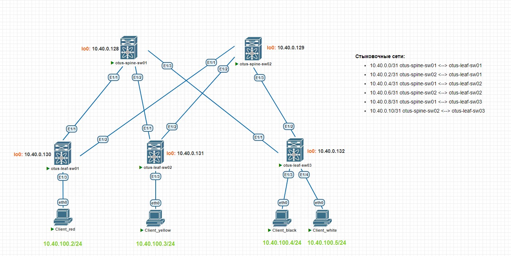
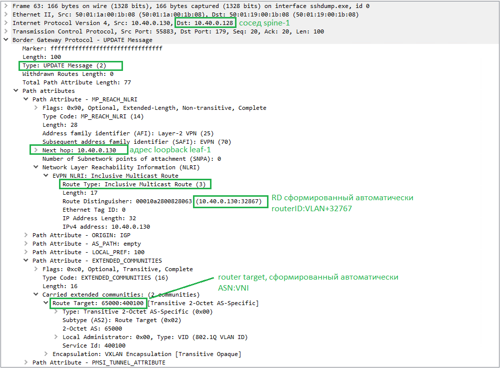
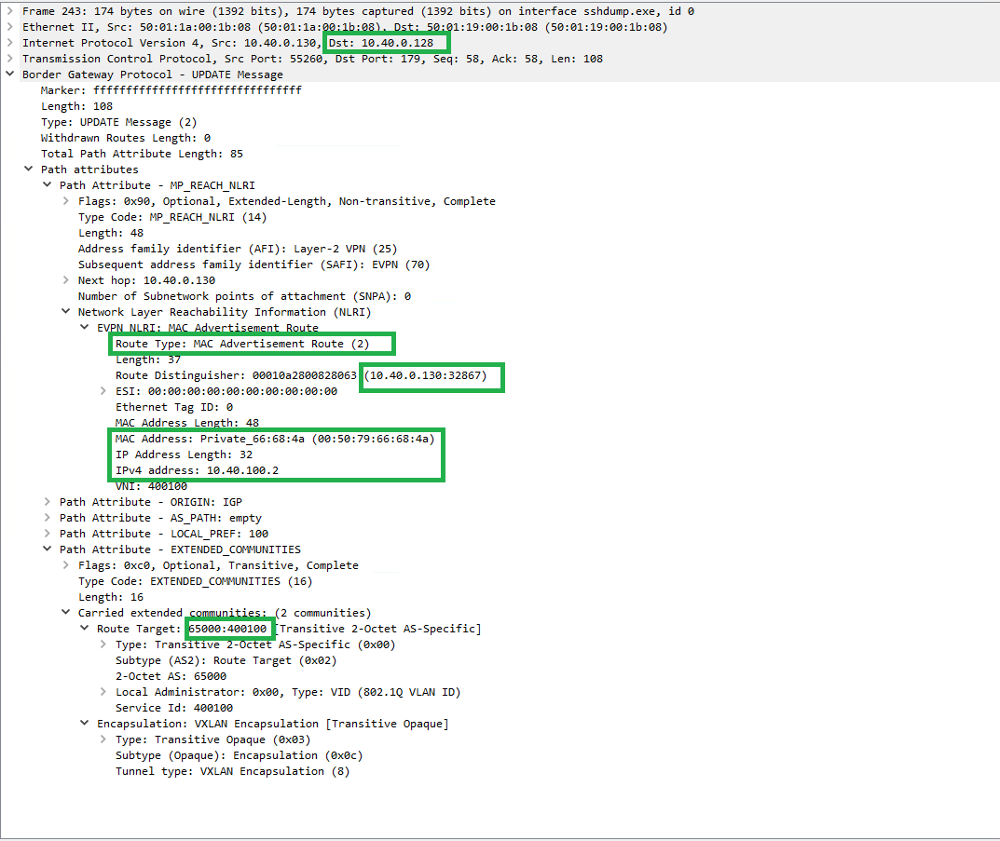
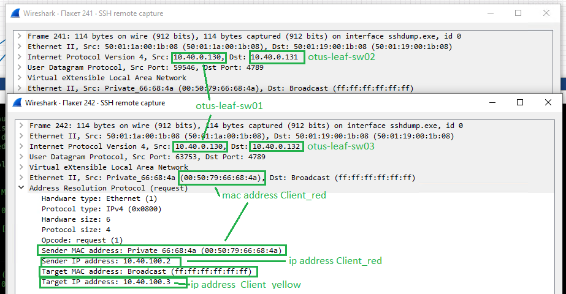
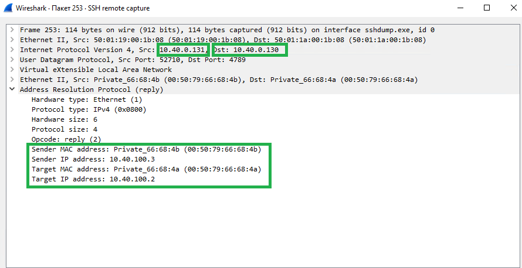
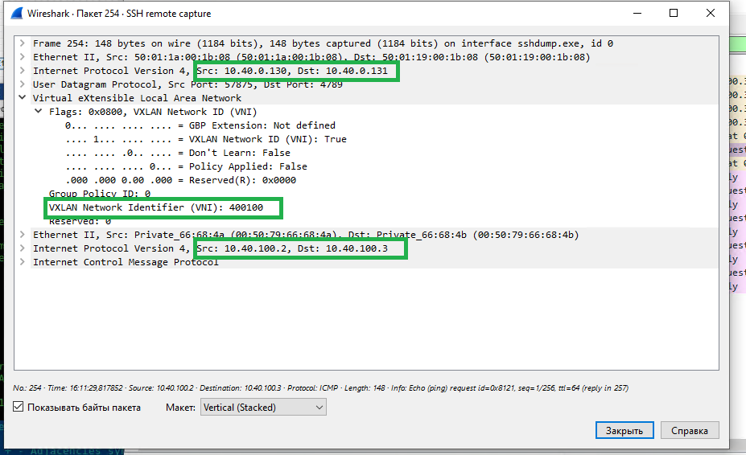

# Лабораторная работа №5. VxLAN. L2VNI
Задачи:
1. Настроить BGP peering между Leaf и Spine в AF l2vpn evpn
2. Настроить связанность между клиентами в первой зоне и убедитесь в её наличии
3. Зафиксировать в документации план работ, адресное пространство, схему сети, настройки
### Схема сети
Схема не изменена по сравнению с предыдущей работой.

### Адресация сети
Для loopback в лаборатной работе №1 была выделена сеть 10.40.0.128/25.
|Address|Description|
|---|---|
|10.40.0.128/32| loopback otus-spine-sw01
|10.40.0.129/32| loopback otus-spine-sw02
|10.40.0.130/32| loopback otus-leaf-sw01
|10.40.0.131/32| loopback otus-leaf-sw02
|10.40.0.132/32| loopback otus-leaf-sw03

Выделим дополнительно сеть для "клиентов" (vPC в схеме)
|Address|Description|
|---|---|
10.40.100.0/24|Client services (vlan 100)|
### Конфигурация
> Изначальная конфигурация взята из лабораторной работы №4. В качестве underlay протокола используется iBGP
#### Настройка iBGP EVPN VXLAN
Настроим overlay при помощи iBGP, ASN используются те же самые, что и для underlay.
Общие параметры настройки:
- номер автономной системы: 65000 (из пула приватных)
- otus-spine-sw01 и otus-spine-sw02 будут Route Reflector'ами

Для дальнешей настройки на всех устройствах включим поддержку EVPN VXLAN.
На SPINE:
```
otus-spine-sw01(config)# nv overlay evpn
otus-spine-sw01(config)# feature nv overlay
```
На LEAF:
```
otus-leaf-sw01(config)# nv overlay evpn
otus-leaf-sw01(config)# feature nv overlay
otus-leaf-sw01(config)# feature vn-segment-vlan-based
```
**Настройка со стороны SPINE**
Настроим три iBGP сессии между каждым Spine и Leaf. Начнем со стороны Spine. Так как для всех трех соседей настройки одинаковы, воспользуемся template peer.
Комментарии:
- указываем, что все LEAF - это клиенты
- указываем update-source loopback0, так как BGP-соседства нам нужны между loopback-ами
- указываем команду retain route-target all, чтобы SPINE не отбрасывали маршруты. По умолчанию маршрутизатор отбрасывает маршруты, если не находит у себя нужного VRF (нужного route-target).
- включаем maximum-paths для работы балансировки
- send-community extended указываем, что будут рассылаться route-target
Конфигурация с otus-spine-sw01 (на втором аналогично):
```
router bgp 65000
  router-id 10.40.0.128
  log-neighbor-changes
  address-family l2vpn evpn
    maximum-paths ibgp 64
    retain route-target all
  template peer iBGP_EVPN_RR_Client
    remote-as 65000
    update-source loopback0
    address-family l2vpn evpn
      route-reflector-client
      send-community
      send-community extended
  neighbor 10.40.0.130
    inherit peer iBGP_EVPN_RR_Client
    description otus-leaf-sw01
  neighbor 10.40.0.131
    inherit peer iBGP_EVPN_RR_Client
    description otus-leaf-sw02
  neighbor 10.40.0.132
    inherit peer iBGP_EVPN_RR_Client
    description otus-leaf-sw03
```
**Настройка со стороны LEAF**
На каждом LEAF необходимо настроить по две iBGP сессии со SPINE.
Комментарии:
- указываем update-source loopback0, так как BGP-соседства нам нужны между loopback-ами
- включаем maximum-paths для работы балансировки
- send-community extended указываем, что будут рассылаться route-target

Конфигурация с otus-leaf-sw01 (на втором и третьем аналогично):
```
router bgp 65000
  router-id 10.40.0.130
  log-neighbor-changes
  address-family l2vpn evpn
    maximum-paths ibgp 64
  template peer iBGP_EVPN
    remote-as 65000
    update-source loopback0
    address-family l2vpn evpn
      send-community
      send-community extended
  neighbor 10.40.0.128
    inherit peer iBGP_EVPN
    description otus-spine-sw01
  neighbor 10.40.0.129
    inherit peer iBGP_EVPN
    description otus-spine-sw02
```
#### Промежуточная проверка работы iBGP в overlay
На данный момент все соседства поднялись, никаких префиксов не отправлено и не получено, потому что отправлять нечего еще.
```
otus-spine-sw01# show bgp l2vpn evpn summary
BGP summary information for VRF default, address family L2VPN EVPN
BGP router identifier 10.40.0.128, local AS number 65000
BGP table version is 5, L2VPN EVPN config peers 3, capable peers 3
0 network entries and 0 paths using 0 bytes of memory
BGP attribute entries [0/0], BGP AS path entries [0/0]
BGP community entries [0/0], BGP clusterlist entries [0/0]

Neighbor        V    AS MsgRcvd MsgSent   TblVer  InQ OutQ Up/Down  State/PfxRcd
10.40.0.130     4 65000       9      20        5    0    0 00:03:14 0         
10.40.0.131     4 65000       6      19        5    0    0 00:00:22 0         
10.40.0.132     4 65000       6      19        5    0    0 00:00:26 0 

otus-spine-sw02# show bgp l2vpn evpn summary
BGP summary information for VRF default, address family L2VPN EVPN
BGP router identifier 10.40.0.129, local AS number 65000
BGP table version is 5, L2VPN EVPN config peers 3, capable peers 3
0 network entries and 0 paths using 0 bytes of memory
BGP attribute entries [0/0], BGP AS path entries [0/0]
BGP community entries [0/0], BGP clusterlist entries [0/0]

Neighbor        V    AS MsgRcvd MsgSent   TblVer  InQ OutQ Up/Down  State/PfxRcd
10.40.0.130     4 65000       9      15        5    0    0 00:03:13 0         
10.40.0.131     4 65000       6      15        5    0    0 00:00:25 0         
10.40.0.132     4 65000       6      15        5    0    0 00:00:28 0    
```
#### Настройка VxLAN
Дальше будут использоваться:
- VLAN 100 для взаимодействия клиентских vPC
- все последующие vni будут выделяться по принципу 40XXXX,где XXXX - номер влана (недостающие цифры заменяются нулями)
- номер vni для данного VLAN:400100

Создадим данный влан на всех LEAFs и привяжем к нему vni.
Конфигурация с otus-leaf-sw01 (на втором и третьем аналогично):
```
otus-leaf-sw01(config)# vlan 100
otus-leaf-sw01(config-vlan)# name client_service_lab05
otus-leaf-sw01(config-vlan)# vn-segment 400100
otus-leaf-sw01(config-vlan)# exit
```
Поднимем интерфейс nve1, с которого будут строится туннели VxLAN и который будет осуществлять декапсуляцию/инкапсуляцию кадров.
А также привяжем наш VNI к данному интерфейсу.
Комментарии:
- укажем, что loopback0 является отправляющим/принимающим узлом
- введем команду host-reachability protocol bgp, указывающую что все маршруты будут изучаться посредством MP-BGP
- включаем suppress-arp, чтобы уменьшить количество BUM трафика в фабрике

Конфигурация с otus-leaf-sw01 (на втором и третьем аналогично):
```
interface nve1
  no shutdown
  host-reachability protocol bgp
  source-interface loopback0
  member vni 400100
    suppress-arp
    ingress-replication protocol bgp
```
Настроим EVPN route-type 2, чтобы передавалась информация о наших подключеных хостах.
Комментарии:
- rd настраиваем в auto
    - автоматически настроится как Type 1 в формате Router ID:номер VLAN + 32767
- route target настраиваем в auto
    - автоматически настроится как Type 0 в формате ASN:VNI

Конфигурация с otus-leaf-sw01 (на втором и третьем аналогично):
```
evpn
  vni 400100 l2
    rd auto
    route-target import auto
    route-target export auto
```
#### Настройка client vPC
Выделим и настроим следующие адреса на client vPC:
|Address|Description|connected|
|---|---|---|
|10.40.100.2/24| Client_red|otus-leaf-sw01
|10.40.100.3/24| Client_yellow|otus-leaf-sw02
|10.40.100.4/24| Client_black|otus-leaf-sw03
|10.40.100.5/24| Client_white|otus-leaf-sw03
```
Client_red> ip 10.40.100.2/24 10.40.100.1
```
Сконфигурируем порты в сторону всех Client vPC.
Конфигурация с otus-leaf-sw01 (на втором и третьем аналогично):
```
interface Ethernet1/3
  description to Client_red
  switchport
  switchport access vlan 100
  no shutdown
```
### Проверка
Проследим все события между конфигурированием нового VNI и запуском ping c оборудования Client_red.
**Рассылка Type-3 маршрута для работы BUM-трафика**
Как только мы создали VNI на otus-leaf-sw01, он формирует и отправляет сообщения BGP Update, которые доходят до всех лифов и спайнов.
Комментарий:
- Отправляется Type-3 Route Inclusive Multicast Route по BGP
- Этот update долетит до всех LEAFs, те в свою очередь в зависимости от наличия/отсутствия такого же route-target у себя либо примут маршрут, либо отбросят
- Те LEAF, что примут, добавят данный маршрут в свою таблицу
- Таким образом, формируются "подписчики" для BUM трафика


Появились маршруты Type-3 в нашей таблице:
```
   Network            Next Hop            Metric     LocPrf     Weight Path
Route Distinguisher: 10.40.0.130:32867    (L2VNI 400100)
*>l[3]:[0]:[32]:[10.40.0.130]/88
                      10.40.0.130                       100      32768 i
*>i[3]:[0]:[32]:[10.40.0.131]/88
                      10.40.0.131                       100          0 i
*>i[3]:[0]:[32]:[10.40.0.132]/88
                      10.40.0.132                       100          0 i
```
**Подключение хоста**
Включим интерфейс eth1/3 в сторону Client_red на otus-leaf-sw01. Хост оказался "тихим" и ничего не отправил. Поэтому запустим с него ping.
LEAF увидел подключенный к себе хост (изучил мак-адрес с интерфейса) и отправляет сообщения BGP Update, которые доходят до всех лифов и спайнов.
Комментарии:
- Отправляется Type-2 Route Mac Advertisement Route (MAC-IP)
- Этот update долетит до всех LEAFs, те в свою очередь в зависимости от наличия/отсутствия такого же route-target у себя либо примут маршрут, либо отбросят
- Те LEAF, что примут, добавят данный маршрут в свою таблицу

Появились маршруты Type-2 в нашей таблице (пример с leaf-sw02):
```
Route Distinguisher: 10.40.0.130:32867
*>i[2]:[0]:[0]:[48]:[0050.7966.684a]:[0]:[0.0.0.0]/216
                      10.40.0.130                       100          0 i
```
**Отправка ARP хостом Client_red**
Перед тем, как пинговать какие-либо адреса в плоской сети, Client_red пошлет широковещательный ARP-запрос
Комментарии:
- Этот запрос получит otus-leaf-sw01 и обработает его как и весь другой BUM-трафик
- otus-leaf-sw01 смотрит в список "подписчиков", полученный когда создавали новую связку VLAN-VNI (при помощи Type-3 route) 
- отправляет всем LEAF, заинтересованных в данном трафике по одной копии ARP-запроса
- LEAF, его получают и отправляют всем нижестоящим хостам, находящимся в данном VNI
посыл ARP
- на ARP-запрос ответит Client_yellow и отправит ARP-ответ, который долетит обратно к otus-leaf-sw01 и затем до Client_red


```
otus-leaf-sw01# show ip arp suppression-cache remote 

Flags: + - Adjacencies synced via CFSoE
       L - Local Adjacency
       R - Remote Adjacency
       L2 - Learnt over L2 interface
       PS - Added via L2RIB, Peer Sync
       RO - Dervied from L2RIB Peer Sync Entry

Ip Address      Age      Mac Address    Vlan Physical-ifindex    Flags    Remote Vtep Addrs

10.40.100.3     00:23:08 0050.7966.684b  100 (null)              R        10.40.0.131 
```
**Ping**
Все нужные маршруты для пересылки unicast-трафика получены выше, поэтому выполняется обычный ping, инкапсулированный в vxlan

```
Client_red> ping 10.40.100.3 

84 bytes from 10.40.100.3 icmp_seq=1 ttl=64 time=31.651 ms
84 bytes from 10.40.100.3 icmp_seq=2 ttl=64 time=12.628 ms
84 bytes from 10.40.100.3 icmp_seq=3 ttl=64 time=14.592 ms
^C
Client_red> ping 10.40.100.4

84 bytes from 10.40.100.4 icmp_seq=1 ttl=64 time=17.564 ms
84 bytes from 10.40.100.4 icmp_seq=2 ttl=64 time=13.154 ms
84 bytes from 10.40.100.4 icmp_seq=3 ttl=64 time=17.933 ms
84 bytes from 10.40.100.4 icmp_seq=4 ttl=64 time=15.159 ms
84 bytes from 10.40.100.4 icmp_seq=5 ttl=64 time=13.892 ms

Client_red> ping 10.40.100.5

10.40.100.5 icmp_seq=1 timeout
84 bytes from 10.40.100.5 icmp_seq=2 ttl=64 time=33.020 ms
84 bytes from 10.40.100.5 icmp_seq=3 ttl=64 time=55.372 ms
84 bytes from 10.40.100.5 icmp_seq=4 ttl=64 time=22.453 ms
84 bytes from 10.40.100.5 icmp_seq=5 ttl=64 time=8.753 ms
```
### Итог
Настроен iBGP между loopback-ами LEAF и SPINE. Настроена связность между клиентскими vPC в единой плоской сети, работа проверена при помощи ping и Wireshark.