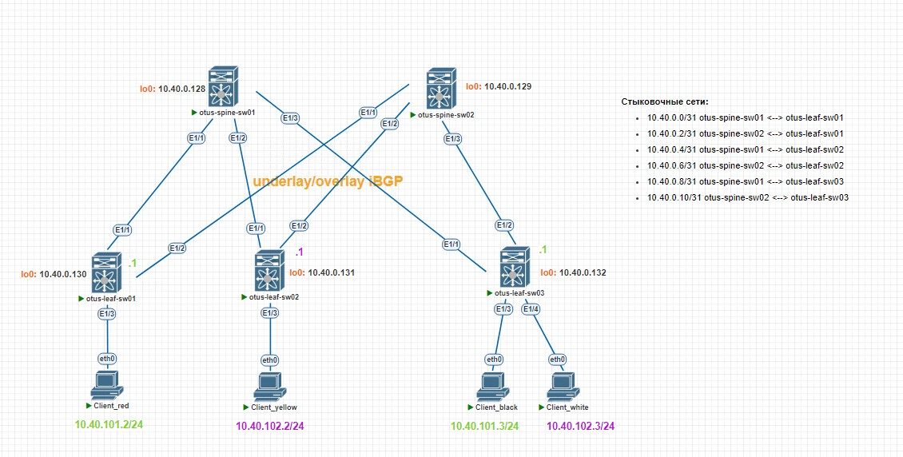

# Лабораторная работа №6. VxLAN. L3VNI
Задачи:
1. Настроить каждого клиента в своем VNI
2. Настроить маршрутизацию между клиентами
3. Зафиксировать в документации план работ, адресное пространство, схему сети, настройки
### Схема сети
Схема не изменена по сравнению с предыдущей работой. Изменены только IP адреса

### Адресация сети
Выделим дополнительно сеть для "клиентов" (vPC в схеме)
|Address|Description|
|---|---|
10.40.101.0/24|Client services (vlan 101)|
10.40.102.0/24|Client services (vlan 102)|

В сеть 10.40.101.0/24 поместим Client_red и Client_black.
В сеть 10.40.102.0/24 поместим Client_yellow и Client_white.
### Конфигурация
> Изначальная конфигурация взята из лабораторной работы №5. В качестве underlay/overlay протокола используется iBGP.

**Создание VLAN**
Для текущей лабораторной работы будут использоваться два VLAN: 101 и 102.
- otus-leaf-sw01: VLAN 101
- otus-leaf-sw02: VLAN 102
- otus-leaf-sw03: VLAN 101 и VLAN 102

VNI выделяем по принципу 40XXXX,где XXXX - номер влана (недостающие цифры заменяются нулями):
- VLAN 101: 400101
- VLAN 102: 400102

Создадим VLAN на всем оборудовании и прокинем в сторону client vPC. Пример настройки с otus-leaf-sw01/02 (на otus-leaf-sw03 аналогично):
```
### otus-leaf-sw01 ###
vlan 101
  name CLIENT_SERVICES_A
  vn-segment 400101

interface nve1
  member vni 400101
    suppress-arp
    ingress-replication protocol bgp

evpn
  vni 400101 l2
    rd auto
    route-target import auto
    route-target export auto

interface Ethernet1/3
  switchport access vlan 101
```
```
### otus-leaf-sw02 ###
vlan 102
  name CLIENT_SERVICES_B
  vn-segment 400102

interface nve1
  member vni 400102
    suppress-arp
    ingress-replication protocol bgp

evpn
  vni 400102 l2
    rd auto
    route-target import auto
    route-target export auto

interface Ethernet1/3
  switchport access vlan 102
```
И пропишем новые адреса на клиентских vPC.
|Address|Description|connected|
|---|---|---|
|10.40.101.2/24| Client_red|otus-leaf-sw01
|10.40.102.2/24| Client_yellow|otus-leaf-sw02
|10.40.101.2/24| Client_black|otus-leaf-sw03
|10.40.102.3/24| Client_white|otus-leaf-sw03
```
Client_red> ip 10.40.101.2/24 10.40.101.1
```
Проверим работу плоской сети, попинговав между собой:
Client_red должен пинговать Client_black (vlan 101)
```
Client_red> ping 10.40.101.3
84 bytes from 10.40.101.3 icmp_seq=1 ttl=64 time=22.128 ms
84 bytes from 10.40.101.3 icmp_seq=2 ttl=64 time=9.798 ms
84 bytes from 10.40.101.3 icmp_seq=3 ttl=64 time=11.587 ms
84 bytes from 10.40.101.3 icmp_seq=4 ttl=64 time=12.623 ms
84 bytes from 10.40.101.3 icmp_seq=5 ttl=64 time=14.178 ms
```
Client_yellow должен пинговать Client_white (vlan 102)
```
VPCS> ping 10.40.102.3
84 bytes from 10.40.102.3 icmp_seq=1 ttl=64 time=40.636 ms
84 bytes from 10.40.102.3 icmp_seq=2 ttl=64 time=30.892 ms
84 bytes from 10.40.102.3 icmp_seq=3 ttl=64 time=16.676 ms
84 bytes from 10.40.102.3 icmp_seq=4 ttl=64 time=27.415 ms
84 bytes from 10.40.102.3 icmp_seq=5 ttl=64 time=31.304 ms
```
**Создание L3VNI для маршрутизации (symmetric IRB)**
Включим на всех LEAF поддержку interface vlan, а также укажем mac-address для работы anycast gateway
```
feature interface-vlan
fabric forwarding anycast-gateway-mac 0001.0001.0001
```
Создаем VRF и указываем его в процессе BGP для передачи маршрутов
```
vrf context CLIENT
  vni 400010
  rd auto
  address-family ipv4 unicast
    route-target both auto
    route-target both auto evpn
router bgp 65000
    log-neighbor-changes
        address-family ipv4 unicast
            advertise l2vpn evpn
```
Для L3VNI будет использоваться VLAN 10 с VNI 400010. Создаем VLAN и SVI, который будет использоваться для маршрутизации трафика между разными л2-доменами. 
```
vlan 10
  name VLAN-FOR-L3VNI-BGP
  vn-segment 400010

interface nve1
member vni 400010 associate-vrf

interface Vlan10
  description FOR-L3VNI-BGP
  no shutdown
  mtu 9216
  vrf member CLIENT
  no ip redirects
  ip forward
```
**Создание SVI для клиентских сетей**
Поднимем л3 интерфейсы для каждого из вланов на оборудовании. Пример настройки с otus-leaf-sw01/02 (на otus-leaf-sw03 аналогично):
```
### otus-leaf-sw01 ###
interface Vlan101
  description CLIENT_SERVICES_A
  no shutdown
  vrf member CLIENT
  ip address 10.40.101.1/24
  fabric forwarding mode anycast-gateway
```
```
### otus-leaf-sw02 ###
interface Vlan102
  description CLIENT_SERVICES_B
  no shutdown
  vrf member CLIENT
  ip address 10.40.102.1/24
  fabric forwarding mode anycast-gateway
```
### Проверка
Проверим связность с хоста Client_red (vlan 101) до шлюза на otus-leaf-sw01:
```
Client_red> ping 10.40.101.1
84 bytes from 10.40.101.1 icmp_seq=1 ttl=255 time=3.564 ms
84 bytes from 10.40.101.1 icmp_seq=2 ttl=255 time=2.026 ms
84 bytes from 10.40.101.1 icmp_seq=3 ttl=255 time=5.216 ms
84 bytes from 10.40.101.1 icmp_seq=4 ttl=255 time=2.274 ms
84 bytes from 10.40.101.1 icmp_seq=5 ttl=255 time=1.835 ms
```
Проверим связность с хоста Client_red (vlan 101) до хостов Client_yellow и Client_white (vlan 102):
```
Client_red> ping 10.40.102.2
84 bytes from 10.40.102.2 icmp_seq=1 ttl=62 time=49.208 ms
84 bytes from 10.40.102.2 icmp_seq=2 ttl=62 time=11.654 ms
84 bytes from 10.40.102.2 icmp_seq=3 ttl=62 time=14.072 ms
84 bytes from 10.40.102.2 icmp_seq=4 ttl=62 time=13.940 ms
84 bytes from 10.40.102.2 icmp_seq=5 ttl=62 time=16.384 ms

Client_red> ping 10.40.102.3
84 bytes from 10.40.102.3 icmp_seq=1 ttl=62 time=39.413 ms
84 bytes from 10.40.102.3 icmp_seq=2 ttl=62 time=16.375 ms
84 bytes from 10.40.102.3 icmp_seq=3 ttl=62 time=12.502 ms
84 bytes from 10.40.102.3 icmp_seq=4 ttl=62 time=24.917 ms
84 bytes from 10.40.102.3 icmp_seq=5 ttl=62 time=17.325 ms
```
На otus-leaf-sw01 есть маршруты Type-2 типа MAC и MAC-IP для адреса 10.40.101.3 (VNI 400101) - VNI, который существует и создан на данном LEAF
```
Route Distinguisher: 10.40.0.132:32868
*>i[2]:[0]:[0]:[48]:[0050.7966.684c]:[0]:[0.0.0.0]/216
                      10.40.0.132                       100          0 i
*>i[2]:[0]:[0]:[48]:[0050.7966.684c]:[32]:[10.40.101.3]/272
```
На otus-leaf-sw01 есть маршруты Type-2 типа ТОЛЬКО MAC-IP для адреса 10.40.102.2 и 10.40.102.3 (VNI 400102) - VNI, который НЕ создан на данном LEAF. Маршрут Type-2 MAC нам отправлялся, но мы его отбросили, так как нет совпадения по route-target. Маршрут Type-2 MAC-IP мы приняли, потому что RT:65000:400010 - существует на otus-leaf-sw01 (L3VNI для маршрутизации).
```
*>i[2]:[0]:[0]:[48]:[0050.7966.6848]:[32]:[10.40.102.3]/272
                      10.40.0.132                       100          0 i
*>i[2]:[0]:[0]:[48]:[0050.7966.684b]:[32]:[10.40.102.2]/272
                      10.40.0.131                       100          0 i
```
В таблице маршрутизации появились следующие маршруты через 400010 (наш созданный L3VNI для маршрутизации)
```
10.40.101.3/32, ubest/mbest: 1/0
    *via 10.40.0.132%default, [200/0], 00:01:11, bgp-65000, internal, tag 65000, segid: 400010 tunnelid: 0xa280084 encap: VXLAN
 
10.40.102.2/32, ubest/mbest: 1/0
    *via 10.40.0.131%default, [200/0], 00:01:11, bgp-65000, internal, tag 65000, segid: 400010 tunnelid: 0xa280083 encap: VXLAN
 
10.40.102.3/32, ubest/mbest: 1/0
    *via 10.40.0.132%default, [200/0], 00:01:11, bgp-65000, internal, tag 65000, segid: 400010 tunnelid: 0xa280084 encap: VXLAN
```
### Итог
Разбросали клиентские vPC в разные домены и настроили между ними маршрутизацию. PING успешно проходит, связность есть.