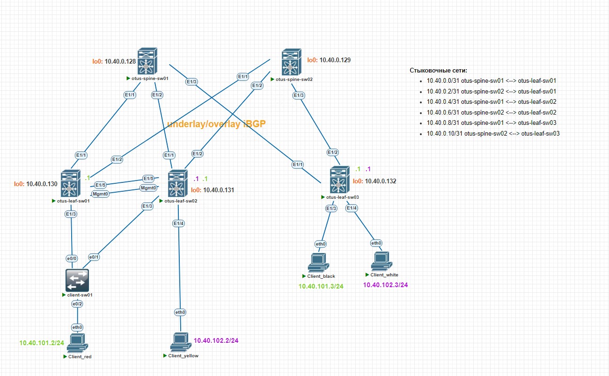
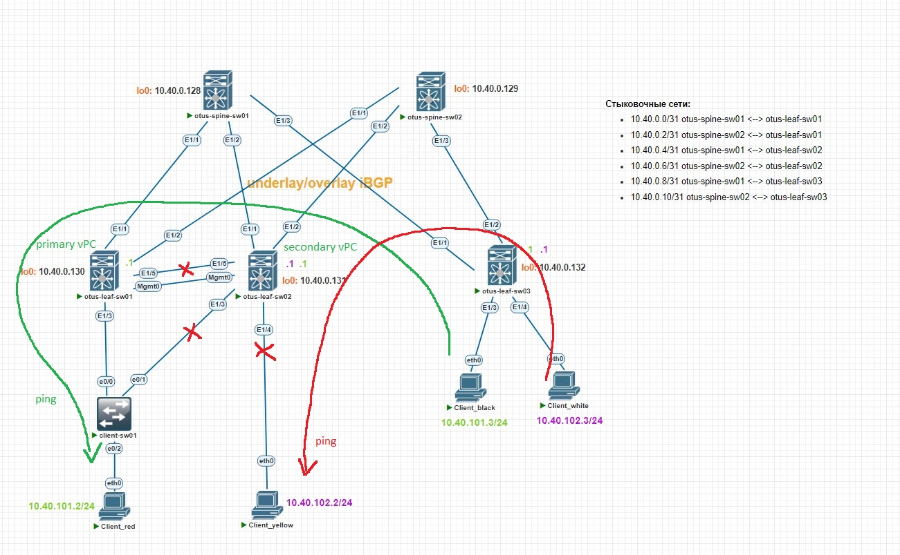

# Лабораторная работа №7. VxLAN. Multihoming
Задачи:
1. Подключить клиентов двумя линками к различным Leaf
2. Настроить агрегированный канал со стороны клиента
3. Настроить multihoming для работы в Overlay сети. Если используете Cisco NXOS - vPC, если иной вендор - то ESI LAG (либо MC-LAG с поддержкой VXLAN)
4. Зафиксировать в документации план работ, адресное пространство, схему сети, настройки
5. (опционально) Протестировать отказоустойчивость - убедиться, что связнность не теряется при отключении одного из линков
### Схема сети
Клиентские устройства vPC (virtual PC) - это очень упрощенные консольные ПК, имеющие один порт для подключения. Чтобы в данной работе настроить агрегирования, немного изменим схему по сравнению с предыдущей работой.
Изменения:
- добавим в схему client-sw01 - обычный L2-коммутатор, который возьмет на себя настройки агрегирования вместо Client_red
  - подключим client-sw01 к vPC-паре (otus-leaf-sw01 и otus-leaf-sw02)
  - Client_red отключим от LEAF и подключим к новому л2-коммутатору
  - создадим шлюз сети 10.40.101.0/24 на otus-leaf-sw02. Так как теперь трафик от Client_red будет приходить на vPC-пару
- Client_yellow оставим как есть, будет играть роль single-homed подключения
- Client_black и Client_white без изменений
- добавим два физических линка между otus-leaf-sw01 и otus-leaf-sw02
    - первый линк будет играть роль vPC peer-link
    - второй линк будет играть роль vPC keep-alive (но вообще Cisco советует подключать не напрямую, а через какое-то оборудование - например, через мгмт сеть)



Вспомним настройки адресации (аналогичны предыдущей работе):
|Address|Description|Devices|
|---|---|---|
10.40.101.0/24|Client services (vlan 101)|Client_red и Client_black|
10.40.102.0/24|Client services (vlan 102)|Client_yellow и Client_white|

### Конфигурация
**Настройка линка для vPC keep-alive**
Выделим новую сеть под MGMT линк.
|network|comment|
|---|---|
10.40.1.0/24|MGMT Fabric LAB007|
10.40.1.2|MGMT otus-leaf-sw01|
10.40.1.3|MGMT otus-leaf-sw01|

Настроим новые линки, которые подключили. Настройка линка для vPC keep-alive будет включать себя IP addess, description и принадлежность vrf management.
```
otus-leaf-sw01(config)# int mgmt0
otus-leaf-sw01(config-if)# description MGMT for vPC keep-alive
otus-leaf-sw01(config-if)# vrf member management 
otus-leaf-sw01(config-if)# ip address 10.40.1.2/24
otus-leaf-sw01(config-if)# no shut
otus-leaf-sw01(config-if)# end
```
Проверим, что ping между устройствами проходит:
```
otus-leaf-sw01# ping 10.40.1.3 vrf management 
PING 10.40.1.3 (10.40.1.3): 56 data bytes
36 bytes from 10.40.1.2: Destination Host Unreachable
Request 0 timed out
64 bytes from 10.40.1.3: icmp_seq=1 ttl=254 time=8.55 ms
64 bytes from 10.40.1.3: icmp_seq=2 ttl=254 time=2.769 ms
64 bytes from 10.40.1.3: icmp_seq=3 ttl=254 time=2.292 ms
64 bytes from 10.40.1.3: icmp_seq=4 ttl=254 time=3.528 ms

--- 10.40.1.3 ping statistics ---
5 packets transmitted, 4 packets received, 20.00% packet loss
round-trip min/avg/max = 2.292/4.284/8.55 ms
```
**Глобальная настройка vPC**
Для начала включим поддержку данной функции на коммутаторах Cisco Nexus, а также поддержку LACP.
```
otus-leaf-sw01(config)# feature vpc
otus-leaf-sw01(config)# feature lacp

```
В vPC паре оба устройства должны иметь общий secondary адрес на loopback0. Выделим новый адрес и настроим его на otus-leaf-sw01/02:
```
otus-leaf-sw02(config)# int lo0
otus-leaf-sw02(config-if)# ip address 10.40.0.140/32 secondary 
otus-leaf-sw02(config-if)# end
```
Создадим vPC domain 40, укажем адреса для работы keep-alive. Также укажем настройку peer-switch, позволяющую рассматривать vPC-пару как единое устройство для протокола STP.
```
otus-leaf-sw01(config)# vpc domain 40
otus-leaf-sw01(config-vpc-domain)# peer-keepalive destination 10.40.1.3 source 10.40.1.2 vrf
management 
otus-leaf-sw01(config-vpc-domain)# peer-switch 
otus-leaf-sw01(config-vpc-domain)# ip arp synchronize 
otus-leaf-sw01(config-vpc-domain)# end
```
Аналогичные настройки вбиты на otus-leaf-sw02

**Настройка линка для vPC peer-link**
В роли peer-link должен быть port-channel, поэтому создадим port-channel1 с одним единственным портом (можно (и нужно!) сделать больше линков для отказоустойчивости, но это лабораторная среда)
```
otus-leaf-sw01(config)# int po1
otus-leaf-sw01(config-if)# description vPC peer-link
otus-leaf-sw01(config-if)# switchport    
otus-leaf-sw01(config-if)# switchport mode trunk
otus-leaf-sw01(config-if)# vpc peer-link 

otus-leaf-sw01(config)# int eth1/5
otus-leaf-sw01(config-if)# channel-group 1 mode active
otus-leaf-sw01(config-if)# no shut
otus-leaf-sw01(config-if)# end
```
**Настройка vPC в сторону client-sw01**
Настроим интерфейсы в сторону client-sw01, объединим их в port-channel и прокинем туда влан 101 с сетью 10.40.101.0/24:
```
otus-leaf-sw01# show run int po3
interface port-channel3
  description to client-sw01
  switchport
  switchport mode trunk
  switchport trunk allowed vlan 101
  vpc 3

otus-leaf-sw01# show run int eth1/3
interface Ethernet1/3
  description to Client_red
  switchport
  switchport mode trunk
  switchport trunk allowed vlan 101
  channel-group 3 mode active
  no shutdown
```
**Настройка client-sw01**
Настроим client-sw01 при помощи минимального количества команд, необходимых для работы:
```
client-sw01(config)#int eth0/0  
client-sw01(config-if)#channel-group 1 mode active 
Creating a port-channel interface Port-channel 1

client-sw01(config-if)#int eth0/1                  
client-sw01(config-if)#channel-group 1 mode active 
client-sw01(config-if)#int po1
client-sw01(config-if)switchport trunk encapsulation dot1q 
client-sw01(config-if)#switchport mode trunk
client-sw01(config-if)#switchport trunk allowed vlan 101
client-sw01(config-if)#end
client-sw01(config)#vlan 101
client-sw01(config-vlan)#exit

client-sw01(config)#int eth0/2
client-sw01(config-if)#description to Client_red
client-sw01(config-if)#switchport mode access 
client-sw01(config-if)#switchport access vlan 101
client-sw01(config-if)#no shut
```
### Проверка
Проверим работу vPC keep-alive. Видим, что пиры друг друга видят и периодически обмениваются сообщениями по udp порту 3200
```
otus-leaf-sw02# show vpc peer-keepalive 

vPC keep-alive status             : peer is alive                 
--Peer is alive for             : (154) seconds, (903) msec
--Send status                   : Success 
--Last send at                  : 2025.05.13 13:11:19 989 ms
--Sent on interface             : mgmt0
--Receive status                : Success
--Last receive at               : 2025.05.13 13:11:20 205 ms
--Received on interface         : mgmt0
--Last update from peer         : (0) seconds, (764) msec

vPC Keep-alive parameters
--Destination                   : 10.40.1.2
--Keepalive interval            : 1000 msec
--Keepalive timeout             : 5 seconds
--Keepalive hold timeout        : 3 seconds
--Keepalive vrf                 : management
--Keepalive udp port            : 3200
--Keepalive tos                 : 192
```
При этом автоматически выбрали роли для vPC пары. Так otus-leaf-sw01 стал primary, а otus-leaf-sw02 стал secondary нодой. 
```
otus-leaf-sw01# show vpc role

vPC Role status
----------------------------------------------------
vPC role                        : primary                       
Dual Active Detection Status    : 0
vPC system-mac                  : 00:23:04:ee:be:28             
vPC system-priority             : 32667
vPC local system-mac            : 50:01:1a:00:1b:08             
vPC local role-priority         : 32667
vPC local config role-priority  : 32667
vPC peer system-mac             : 50:01:46:00:1b:08             
vPC peer role-priority          : 32667
vPC peer config role-priority   : 32667
```
Проверим работу vpc в общем и увидим, что peer-link в UP, согласованы между пирами как глобальные параметры, так и второстепенные.
```
otus-leaf-sw01# show vpc
Legend:
(*) - local vPC is down, forwarding via vPC peer-link

vPC domain id                     : 40  
Peer status                       : peer adjacency formed ok      
vPC keep-alive status             : peer is alive                 
Configuration consistency status  : success 
Per-vlan consistency status       : success                       
Type-2 consistency status         : success 
vPC role                          : primary                       
Number of vPCs configured         : 0   
Peer Gateway                      : Disabled
Dual-active excluded VLANs        : -
Graceful Consistency Check        : Enabled
Auto-recovery status              : Disabled
Delay-restore status              : Timer is off.(timeout = 30s)
Delay-restore SVI status          : Timer is off.(timeout = 10s)
Operational Layer3 Peer-router    : Disabled
Virtual-peerlink mode             : Disabled

vPC Peer-link status
---------------------------------------------------------------------
id    Port   Status Active vlans    
--    ----   ------ -------------------------------------------------
1     Po1    up     1,10,101-102
```
vPC в сторону client-sw01 поднялся и работает:
```
otus-leaf-sw01# show vpc 3
vPC status
----------------------------------------------------------------------------
Id    Port          Status Consistency Reason                Active vlans
--    ------------  ------ ----------- ------                ---------------
3     Po3           up     success     success               101   
```
Выполним ping от Client_red (находится за vPC парой otus-leaf-sw01/02) до Client_black (находится за otus-leaf-sw03). Ping проходит, значит связность присутствует:
```
Client_red> ping 10.40.101.3

84 bytes from 10.40.101.3 icmp_seq=1 ttl=64 time=12.860 ms
84 bytes from 10.40.101.3 icmp_seq=2 ttl=64 time=12.050 ms
84 bytes from 10.40.101.3 icmp_seq=3 ttl=64 time=11.009 ms
84 bytes from 10.40.101.3 icmp_seq=4 ttl=64 time=10.681 ms
84 bytes from 10.40.101.3 icmp_seq=5 ttl=64 time=9.640 ms
```
Client_red имеет mac address - 0050.7966.684a и IP 10.40.101.2. Оборудование otus-leaf-sw03 видит данный MAC за 10.40.0.140 (адрес vPC-пары):
```
otus-leaf-sw03# show mac address-table address 0050.7966.684a
Legend: 
        * - primary entry, G - Gateway MAC, (R) - Routed MAC, O - Overlay MAC
        age - seconds since last seen,+ - primary entry using vPC Peer-Link,
        (T) - True, (F) - False, C - ControlPlane MAC, ~ - vsan
   VLAN     MAC Address      Type      age     Secure NTFY Ports
---------+-----------------+--------+---------+------+----+------------------
C  101     0050.7966.684a   dynamic  0         F      F    nve1(10.40.0.140)
```
### Тестирование ситуации отключения peerlink
Порвем peerlink между otus-leaf-sw01 и otus-leaf-sw02.
Что произойдет:
- так как otus-leaf-sw02 secondary node, то она потушит все свои vPC downlink
- ping до Client_red продолжит идти через primary node
- ping до Client_yellow оборвется, так как он станет изолирован 
  - можно еще добавить команду vpc orphan-port suspend, тогда Nexus положит порт в сторону Client_yellow (полезно при подключении каких-нибудь active-standby устройств (ex. firewall))


Логи падения с otus-leaf-sw02:
```
2025 May 15 10:35:59 otus-leaf-sw02 %$ VDC-1 %$ %VPC-2-VPC_SUSP_ALL_VPC: Peer-link going down, suspending all vPCs on second
ary. If vfc is bound to vPC, then only ethernet vlans of that VPC shall be down.
2025 May 15 10:35:59 otus-leaf-sw02 %$ VDC-1 %$ %VPC-3-INTF_CONSISTENCY_FAILED: In domain 40, VPC 3 configuration is not con
sistent (Peer-link is down)
2025 May 15 10:35:59 otus-leaf-sw02 %$ VDC-1 %$ %VPC-3-VPC_PEER_LINK_DOWN: VPC Peer-link is down
2025 May 15 10:36:29 otus-leaf-sw02 %$ VDC-1 %$ %USER-2-SYSTEM_MSG: NVE: send reinit to bring down nve1 - nve
```
```
otus-leaf-sw02# sh vpc
vPC domain id                     : 40  
Peer status                       : peer link is down             
vPC keep-alive status             : peer is alive                 
-------
vPC Peer-link status
---------------------------------------------------------------------
id    Port   Status Active vlans    
--    ----   ------ -------------------------------------------------
1     Po1    down   -                                                           
         

vPC status
----------------------------------------------------------------------------
Id    Port          Status Consistency Reason                Active vlans
--    ------------  ------ ----------- ------                ---------------
3     Po3           down   failed      Peer-link is down     -              

otus-leaf-sw02# sh int status
Eth1/3        to Client_red      suspndByV trunk     auto    auto    10g        
Eth1/4        to Client_yellow   vpcPeerLn 102       auto    auto    10g        
Eth1/5        vPC peerlink       suspended trunk     auto    auto    10g      
```

**Вывод**
Лучше подключать orphan device к vPC primary оборудованию, также выставлять явно приоритет, чтобы primary нода была однозначно выбрана.
А еще лучше по возможности избегать таких ситуаций, например подключить как Client_red к дополнительному коммутатору.

### Итог
Настроили vPC, подключили по-разному клиентские устройства и посмотрели поведение при отключенном vPC peerlink

P.S. После написания лабораторной работы я узнала про то, что рекомендуют делать два лупбека. Один будет использовать для control-plane, второй для data-plane
т.е.:
```
interface loopback0
description BGP-OVERLAY
ip address x.x.x.x/32

interface loopback1
description VTEP
ip address y.y.y.y/32
ip address z.z.z.z/32 secondary
```