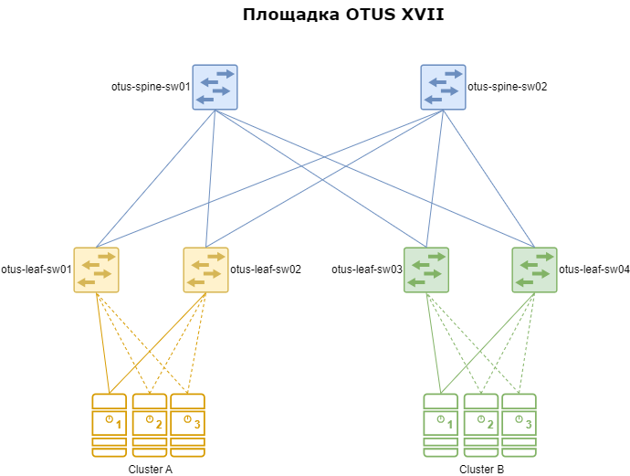
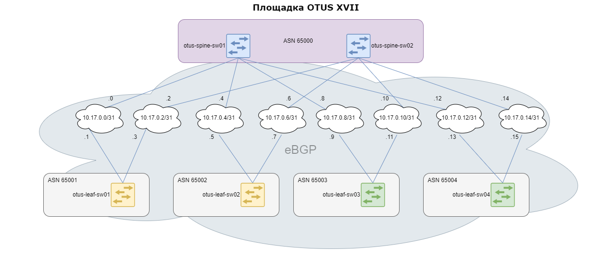
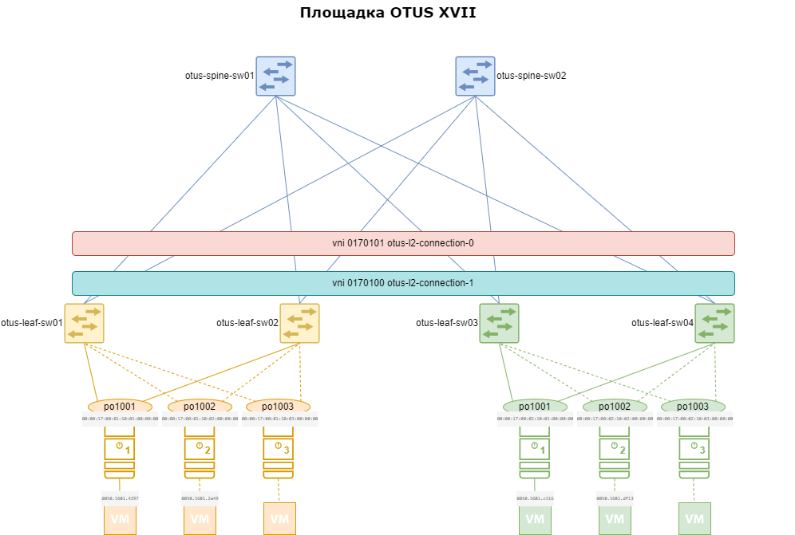
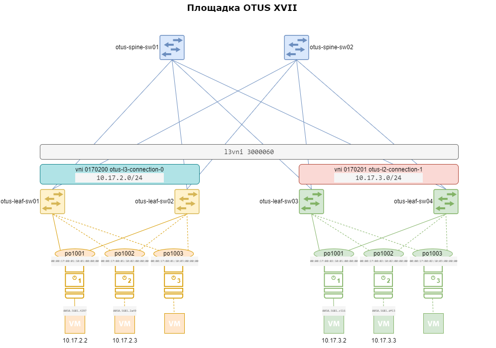

# Проектная работа на тему "Построение фабрики EVPN VXLAN на оборудовании B4COM"

### Введение <a name="Введение"></a> 
В данном проекте рассматривается построение фабрики EVPN VXLAN на оборудовании B4COM.

#### Задачи <a name="Задачи"></a> 
- настроить underlay
- настроить overlay
- подключить два кластера виртуализации
  - каждый сервер подключается двумя линками для обеспечения отказоустойчивости
- настроить между ними L2-связность
- настроить между ними L3-связность

### Топология сети <a name="Топология_сети"></a> 
В данной работе планируется построение сети, состоящей из 2 SPINE и 4 LEAF. Название данной сети (или площадки) возьмем "Площадка OTUS XVII"*.
Ниже представлена структурная схема сети:

Фабрика будет состоять из следующих компонентов:
|Device|Role|Model|
|---|---|---|
otus-spine-sw01|spine|B4COM серии CS4100
otus-spine-sw02|spine|B4COM серии CS4100
otus-leaf-sw01|leaf|B4COM серии CS4100
otus-leaf-sw02|leaf|B4COM серии CS4100
otus-leaf-sw03|leaf|B4COM серии CS4100
otus-leaf-sw04|leaf|B4COM серии CS4100
Cluster A|virtualization cluster|3 servers**
Cluster B|virtualization cluster|3 servers**

\* Название площадки, также как и ее номер взят совершенно рандомно и случайно=)
\** Для каждого кластера будет использоваться 3 сервера для упрощения схемы. Также не будут рассматриваться модели серверов и тд.

### Адресация <a name="Адресация"></a>
Для всей площадки будет использоваться сеть **10.17.0.0/16**
|Network|||Description|
|---|---|---|---|
10.17.0.0/24|||Network|
||10.17.0.0/25||P2P for Spine-Leaf
|||10.17.0.0/31|otus-spine-sw01 <--> otus-leaf-sw01
|||10.17.0.2/31|otus-spine-sw02 <--> otus-leaf-sw01
|||10.17.0.4/31|otus-spine-sw01 <--> otus-leaf-sw02
|||10.17.0.6/31|otus-spine-sw02 <--> otus-leaf-sw02
|||10.17.0.8/31|otus-spine-sw01 <--> otus-leaf-sw03
|||10.17.0.10/31|otus-spine-sw02 <--> otus-leaf-sw03
|||10.17.0.12/31|otus-spine-sw01 <--> otus-leaf-sw04
|||10.17.0.14/31|otus-spine-sw02 <--> otus-leaf-sw04
||10.17.0.128/25||Loopback addresses for Spine, Leaf
|||10.17.0.128/32| loopback otus-spine-sw01
|||10.17.0.129/32| loopback otus-spine-sw02
|||10.17.0.130/32| loopback otus-leaf-sw01
|||10.17.0.131/32| loopback otus-leaf-sw02
|||10.17.0.132/32| loopback otus-leaf-sw03
|||10.17.0.133/32| loopback otus-leaf-sw04
10.17.2.0/23|||L3VNI|
|||10.17.2.0/24| otus-l3-connection-0
|||10.17.3.0/24| otus-l3-connection-1

**VLAN**
|VNI|VLAN|Description|
|---|---|---|
0170100|100|otus-l2-connection-0|
0170101|101|otus-l2-connection-1|
0170200|200|otus-l3-connection-0|
0170201|201|otus-l3-connection-1|

### Используемые технологии <a name="Используемые_технологии"></a> 
Ниже перечислены технологии, используемые в данном проекте:
|Для чего|Технология|Комментарий|
|---|---|---|
underlay|eBGP|прост в настройке и администрировании
overlay|eBGP|
подключение серверов|ESI LAG|для обеспечения отказоустойчивости
|для избежания ситуации split-brain|Trigger Failover Configuration (TFO)|

### Настройка <a name="Настройка"></a>
#### Настройка underlay

Для стыка между SPINE-LEAF выделены /31 P2P сети. Где первый адрес в сети - адрес для SPINE. Второй адрес - адрес для LEAF.
Пример:
+ **10.17.0.0/31 otus-spine-sw01 <--> otus-leaf-sw01**
    + 10.17.0.0 otus-spine-sw01
    + 10.17.0.1 otus-leaf-sw01
+ **10.17.0.2/31 otus-spine-sw02 <--> otus-leaf-sw01**
    + 10.17.0.2 otus-spine-sw02
    + 10.17.0.3 otus-leaf-sw01

**Настройка линков**
Настройка линков включает базовые команды: description, ip address, mtu
Пример настройки со otus-spine-sw01 (на всех остальных аналогично):
```
interface ce1
 description otus-leaf-sw01 [ce49]
 ip address 10.17.0.0/31
 mtu 9216
 no shutdown

interface ce2
 description otus-leaf-sw02 [ce49]
 ip address 10.17.0.2/31
 mtu 9216
 no shutdown

interface ce3
 description otus-leaf-sw03 [ce49]
 ip address 10.17.0.4/31
 mtu 9216
 no shutdown

interface ce4
 description otus-leaf-sw04 [ce49]
 ip address 10.17.0.6/31
 mtu 9216
 no shudtdown
```
**Настройка loopback**
Настройка лупбека включает базовые команды: description, ip address
```
interface lo
 ip address 10.17.0.128/32 secondary
```
Secondary потому что на лупбеке уже есть адрес по умолчанию от системы (127.0.0.1/8)
**Настройка маршрутизации underlay**
В качестве underlay протокола будет использоваться eBGP. SPINE имеют одинаковые ASN, у LEAF каждая своя:
|Устройство|ASN|
|---|---|
otus-spine-sw01|65000
otus-spine-sw02|65000
otus-leaf-sw01|65001
otus-leaf-sw02|65002
otus-leaf-sw03|65003
otus-leaf-sw04|65004

На каждом оборудовании создадим prefix-list с сетями underlay (сеть, содержащая loopback-адреса и p2p). Затем привяжем его к route-map, который будет использовать при настройке eBGP-сессии.
Данная настройка необходима для защиты анонсирования маршрутов.
Конфигурация на всем оборудовании одинакова:
```
ip prefix-list eBGP_Underlay_connected
 seq 5 permit 10.17.0.0/24 le 32

route-map eBGP_Underlay_connected permit 10
 match ip address prefix-list eBGP_Underlay_connected

route-map eBGP_Underlay_connected deny 100
```
По комментариям:
- no bgp inbound-route-filter - тоже самое, что и retain route-target all в Cisco. Необходимо настроить только на SPINE (ведь нам не нужны все-все маршруты на leafs)
- если в будущем планируется добавлять новые сети в route-map - то необходимо будет сделать BGP soft reset

Пример настройки со otus-spine-sw01 (на всех остальных аналогично):
```
router bgp 65000
 bgp router-id 10.17.0.128
 bgp bestpath as-path multipath-relax
 bgp log-neighbor-changes
 no bgp inbound-route-filter
 bgp graceful-restart
 neighbor 10.17.0.1 remote-as 65001
 neighbor 10.17.0.5 remote-as 65002
 neighbor 10.17.0.9 remote-as 65003
 neighbor 10.17.0.13 remote-as 65004
 neighbor 10.17.0.1 description otus-leaf-sw01
 neighbor 10.17.0.5 description otus-leaf-sw02
 neighbor 10.17.0.9 description otus-leaf-sw03
 neighbor 10.17.0.13 description otus-leaf-sw04

 address-family ipv4 unicast
  max-paths ebgp 64
  redistribute connected route-map eBGP_Underlay_connected
  neighbor 10.17.0.1 activate
  neighbor 10.17.0.1 allowas-in 1
  neighbor 10.17.0.5 activate
  neighbor 10.17.0.5 allowas-in 1
  neighbor 10.17.0.9 activate
  neighbor 10.17.0.9 allowas-in 1
  neighbor 10.17.0.13 activate
  neighbor 10.17.0.13 allowas-in 1
  exit-address-family
```
Проверить поднятие сессии можно при помощи show ip bgp summary.
```
otus-leaf-sw01#show ip bgp summary 
BGP router identifier 10.17.0.130, local AS number 65001
BGP table version is 75
51 BGP AS-PATH entries
4 BGP community entries
64  Configured ebgp ECMP multipath: Currently set at 64

Neighbor                 V   AS   MsgRcv    MsgSen TblVer   InQ   OutQ    Up/Down   State/PfxRcd
10.17.0.0              4 65000 94114      94028      75      0      0  03w6d21h             159
10.17.0.2              4 65000 94155      94085      75      0      0  03w6d21h             159

Total number of neighbors 2

Total number of Established sessions 2
```
#### Настройка overlay

Настроим overlay при помощи eBGP, ASN используются те же самые, что и для underlay.
По комментариям:
- BFD только программный (hardware пока не реализован в B4COM)

Пример настройки со otus-spine-sw01 (на всех остальных аналогично):
```
router bgp 65000
 neighbor 10.17.0.130 remote-as 65001
 neighbor 10.17.0.130 fall-over bfd multihop
 neighbor 10.17.0.130 description otus-leaf-sw01
 neighbor 10.17.0.130 update-source lo
 neighbor 10.17.0.130 advertisement-interval 0
 neighbor 10.17.0.131 remote-as 65002
 neighbor 10.17.0.131 fall-over bfd multihop
 neighbor 10.17.0.131 description otus-leaf-sw02
 neighbor 10.17.0.131 update-source lo
 neighbor 10.17.0.131 advertisement-interval 0
 neighbor 10.17.0.132 remote-as 65003
 neighbor 10.17.0.132 fall-over bfd multihop
 neighbor 10.17.0.132 description otus-leaf-sw03
 neighbor 10.17.0.132 update-source lo
 neighbor 10.17.0.132 advertisement-interval 0
 neighbor 10.17.0.133 remote-as 65004
 neighbor 10.17.0.133 fall-over bfd multihop
 neighbor 10.17.0.133 description otus-leaf-sw04
 neighbor 10.17.0.133 update-source lo
 neighbor 10.17.0.133 advertisement-interval 0

 address-family l2vpn evpn
  neighbor 10.17.0.130 activate
  neighbor 10.17.0.131 activate
  neighbor 10.17.0.132 activate
  neighbor 10.17.0.133 activate
 exit-address-family
```
Проверить поднятие сессии можно при помощи show bgp l2vpn evpn summary.
```
otus-leaf-sw01#show bgp l2vpn evpn summary
BGP router identifier 10.17.0.130, local AS number 65001
BGP table version is 1030338
51 BGP AS-PATH entries
4 BGP community entries

Neighbor                 V   AS   MsgRcv    MsgSen TblVer   InQ   OutQ    Up/Down   State/PfxRcd     AD  MACIP  MCAST    ESI  PREFIX-ROUTE
10.17.0.128               4 65000 5338883    3093663 1030338      0      0  03w6d21h            6294   3348   2308    422    206     10
10.17.0.129               4 65000 3028653     900110 1030336      0      0  03w6d21h            6294   3348   2308    422    206     10

Total number of neighbors 2

Total number of Established sessions 2
```
#### Настройка VXLAN
Включаем поддержку VXLAN, поддержку multihoming и L3:
```
nvo vxlan enable
evpn vxlan multihoming enable
nvo vxlan irb
```
И для каждого VTEP назначаем ему IP (берем адрес loopback). Этот адрес будет использоваться как source для построения VXLAN-туннелей
```
nvo vxlan vtep-ip-global 10.17.0.130
```
Для работы IRB указываем anycast mac:
```
evpn irb-forwarding anycast-gateway-mac 0001.0001.0001
```
Проверить, что туннели поднялись можно следующей командой:
```
otus-leaf-sw01#sh nvo vxlan tunnel 
VXLAN Network tunnel Entries 
Source           Destination      Status        Up/Down       Update        
======================================================================
10.17.0.130       10.17.0.131     Installed     01w1d22h      01w1d22h     
10.17.0.130       10.17.0.132     Installed     01w1d22h      01w1d22h     
10.17.0.130       10.17.0.133     Installed     01w1d22h      01w1d22h         
```
#### Настройка портов в сторону серверов
Сервера будут подключаться посредством ESI LAG к двум LEAFs для обеспечения отказоустойчивости.
Комментарии:
- указываем номер ESI LAG (должен быть одинаковым на двух LEAFs). Указываем такой, чтобы было удобно администрировать
  - 0017.0001.1001 - LEAF1/2 po1001
  - 0017.0001.1002 - LEAF1/2 po1002
  - 0017.0002.1001 - LEAF1/2 po1001
  - 0017.0002.1002 - LEAF1/2 po1002
- включаем TFO - Trigger Failover Configuration - для избежания ситуации split-brain
  - предварительно необходимо включить глобально (tfo enable; fog 1 enable). Fog 1 - это Fail over group
  - указываем, что линки к серверам являются downlink
  - у LEAFs в сторону SPINE - указываем, что это link-type uplink
  - *что нам это дало:* при внезапной проблеме с обоими линками в сторону SPINE - у нас автоматически выключатся линки в сторону серверов
- включаем lldp на интерфейсах и указываем, какую информацию надо передавать (в B4COM нельзя сделать это глобально для всех линков)

Пример настройки со otus-leaf-sw01 и otus-leaf-sw02 (на всех остальных аналогично):
```
interface po1001
 description Cluster-A_server_1
 switchport
 load-interval 30
 mtu 9216
 evpn multi-homed system-mac 0017.0001.1001
 port-channel load-balance rtag7
 link-type downlink
 fog 1 type cpg
 l2protocol lldp peer

interface xe1
 description Cluster-A_server_1
 channel-group 1001 mode active
 lldp-agent
  set lldp enable txrx 
  set lldp chassis-id-tlv ip-address  
  set lldp port-id-tlv if-name 
  lldp tlv basic-mgmt system-name select  
  lldp tlv basic-mgmt system-description select  
  dcbx enable 
  exit 
------------------------
interface po1002
 description Cluster-A_server_2
 switchport
 load-interval 30
 mtu 9216
 evpn multi-homed system-mac 0017.0001.1002
 port-channel load-balance rtag7
 link-type downlink
 fog 1 type cpg
 l2protocol lldp peer

interface xe2
 description Cluster-A_server_2
 channel-group 1001 mode active
 lldp-agent
  set lldp enable txrx 
  set lldp chassis-id-tlv ip-address  
  set lldp port-id-tlv if-name 
  lldp tlv basic-mgmt system-name select  
  lldp tlv basic-mgmt system-description select  
  dcbx enable 
  exit 
```
**Важно:** информацию по статусу созданных ESI LAG нельзя посмотреть (например кто designated forwarder), пока с ним не будет ассоциироваться хотя бы один VNI.
#### Настройка L2-связности

Настроим L2-связность между серверами. Возьмем для этого VLAN 100 (с VNI 0170100) и VLAN 101 (c VNI 0170101)
Комментарии:
- rd и rt надо указывать ручками (автоматического назначения, как в cisco - нет)
- указываем в качестве control-plane протокол evpn-bgp
Пример настройки со otus-leaf-sw01:
```
mac vrf v100
  evpn-vlan-service vlan-based
  description otus-l2-connection-0
  rd 10.17.0.130:100
  route-target both 65000:0170100

nvo vxlan id 0170100 ingress-replication inner-vid-disabled 
  vxlan host-reachability-protocol evpn-bgp v100

mac vrf v101
  evpn-vlan-service vlan-based
  description otus-l2-connection-1
  rd 10.17.0.130:101
  route-target both 65000:0170101

nvo vxlan id 0170101 ingress-replication inner-vid-disabled 
  vxlan host-reachability-protocol evpn-bgp v101
```
Пример настройки со otus-leaf-sw02:
```
mac vrf v100
  evpn-vlan-service vlan-based
  description otus-l2-connection-0
  rd 10.17.0.131:100
  route-target both 65000:0170100

nvo vxlan id 0170100 ingress-replication inner-vid-disabled 
  vxlan host-reachability-protocol evpn-bgp v100

mac vrf v101
  evpn-vlan-service vlan-based
  description otus-l2-connection-1
  rd 10.17.0.131:101
  route-target both 65000:0170101

nvo vxlan id 0170101 ingress-replication inner-vid-disabled 
  vxlan host-reachability-protocol evpn-bgp v101
```
Теперь необходимо пробросить созданный VLAN в наши сервера. В B4COM это делается через отдельную конфигурацию (не в конфигурации интерфейса). Пишется сопоставление нужного port-channel с нужным номером VLAN.

**Важно:** таких связок port-channel -- vlan может быть 16000 на одном оборудовании (аппаратное ограничение). То есть если кластер состоит из 48 серверов (48 портов на LEAFs) и во все эти сервера должно быть проброшено одинаковое количество VLAN: 16000/48 ~ 333 влана - это максимум на одном LEAF

Пример настройки со otus-leaf-sw01 (на всех остальных аналогично):
```
# для server_1
nvo vxlan access-if port-vlan po1001 100
 description otus-l2-connection-0
 map vnid 0170100

nvo vxlan access-if port-vlan po1001 101
 description otus-l2-connection-1
 map vnid 0170101

# для server_2
nvo vxlan access-if port-vlan po1002 100
 description otus-l2-connection-0
 map vnid 0170100

nvo vxlan access-if port-vlan po1002 101
 description otus-l2-connection-1
 map vnid 0170101
```
Выше был показан пример проброса в режиме "транка", то есть для другого VLAN проброс будет аналогичен.
Теперь пример как пробросить в режиме "аксесс":
```
nvo vxlan access-if port *какой-то порт*
 description *какой-то дескрипшен*
 map vnid *VNI*
```
Проверка. Команд для проверки несколько. Начнем с самой первой "show nvo vxlan". Показывает все созданные связки port-channel -- VNI, также здесь показывается кто является designated-forwarder
```
otus-leaf-sw01#show nvo vxlan 
VXLAN Information 
================= 
   Codes: NW - Network Port 
          AC - Access Port 
         (u) - Untagged 

VNID     VNI-Name     VNI-Type Type Interface ESI                           VLAN      DF-Status Src-Addr         Dst-Addr         Router-Mac      
_______________________________________________________________________________________________________________________________________________
0170100  ----         --       AC   po1001    00:00:17:00:01:10:01:00:00:00 100       DF            ----             ----            
0170101  ----         --       AC   po1001    00:00:17:00:01:10:01:00:00:00 101       NON-DF        ----             ----            
0170100  ----         --       AC   po1002    00:00:17:00:01:10:02:00:00:00 100       DF            ----             ----            
0170101  ----         --       AC   po1002    00:00:17:00:01:10:02:00:00:00 101       NON-DF        ----             ----            
```
Следующая команда "show nvo vxlan mac-table" - посмотреть мак таблицу.
Комментарии:
- если вбить чисто "show nvo vxlan mac-table" - покажет софтварную таблицу
- если вбить "show nvo vxlan mac-table hardware" - покажет хардварную таблицу (то, что программируется в чип)

Бывает полезно сравнивать две эти команды при траблшутинге. В идеале они должны выдавать одинаковую информацию, но бывают разные ситуации. Если вдруг что-то не так запрограммировалось, можно попробовать почистить туннели (clear nvo vxlan tunnels).
В выводе разницы особо нет (и не должно быть). Только в первом случае показывается количество MAC move (сколько раз ВМ переезжала с хоста на хост).
```
otus-leaf-sw01#show nvo vxlan mac-table vni 0170100
=========================================================================================================================================
                                                     VXLAN MAC Entries 
=========================================================================================================================================
VNID       Interface VlanId    In-VlanId Mac-Addr       VTEP-Ip/ESI                    Type            Status     MAC move AccessPortDesc
_________________________________________________________________________________________________________________________________________
0170100    po1001    100       ----      0050.5681.4297 00:00:17:00:01:10:01:00:00:00  Dynamic Local   -------    18       otus-l2-connection-0
0170100    ----      ----      ----      0050.5681.c516 00:00:17:00:02:10:01:00:00:00  Dynamic Remote  -------    0        -------   
0170100    ----      ----      ----      0050.5681.df13 00:00:17:00:02:10:02:00:00:00  Dynamic Remote  -------    0        -------   
0170100    po1002    100       ----      0050.5681.2a49 00:00:17:00:01:10:02:00:00:00  Dynamic Local   -------    19       otus-l2-connection-1
```
```
=========================================================================================================================================
                                                     VXLAN MAC Entries 
=========================================================================================================================================
VNID       Interface VlanId    In-VlanId Mac-Addr       VTEP-Ip/ESI                    Type            Status     Time-out AccessPortDesc
_________________________________________________________________________________________________________________________________________
0170100    po1001    100       ----      0050.5681.4297 00:00:17:00:01:10:01:00:00:00  Dynamic Local   -------    572      otus-l2-connection-0
0170100    po1002    100       ----      0050.5681.2a49 00:00:17:00:01:10:02:00:00:00  Dynamic Local   -------    572      otus-l2-connection-1
0170100    ---       ----      ----      0050.5681.c516 00:00:17:00:02:10:01:00:00:00  Remote          -------    ---      -------   
0170100    ---       ----      ----      0050.5681.df13 00:00:17:00:02:10:02:00:00:00  Remote          -------    ---      -------   
```
#### Настройка L3-связности

Поднимать L3-шлюз будем во влане 200 (name otus-l3-connection-0) и во влане 201 (name otus-l3-connection-1). Поэтому для начала создадим влан 200 и 201
Конфигурация на otus-leaf-sw01 (на otus-leaf-sw02 аналогично):
```
mac vrf v200
  evpn-vlan-service vlan-based
  description otus-l3-connection-0
  rd 10.17.0.131:200
  route-target both 65000:0170200

nvo vxlan id 0170200 ingress-replication inner-vid-disabled 
  vxlan host-reachability-protocol evpn-bgp v200
```
Конфигурация на otus-leaf-sw03 (на otus-leaf-sw04 аналогично):
```
mac vrf v201
  evpn-vlan-service vlan-based
  description otus-l3-connection-1
  rd 10.17.0.131:201
  route-target both 65000:0170201

nvo vxlan id 0170201 ingress-replication inner-vid-disabled 
  vxlan host-reachability-protocol evpn-bgp v201
```
Теперь необходимо создать VRF на всем оборудовании.
Комментарии:
- router-id = rd - у каждого LEAF свой
- указываем l3vni (на всех LEAFs одинаковый) - через что будет ходить трафик между разными сетями в этом VRF
Конфигурация на otus-leaf-sw01 (на всех остальных аналогично):
```
ip vrf OTUS-L3
 description OTUS-L3
 router-id 10.17.0.130
 rd 10.17.0.130:3060
 route-target both 65000:3000060
 l3vni 3000060
```
Теперь необходимо, чтобы маршруты данного VRF передавались в BGP и отправлялись дальше:
```
router bgp 65001
 address-family ipv4 vrf OTUS-L3
  max-paths ebgp 64
  redistribute connected
  exit-address-family
```
Теперь создаем сам шлюз наших новых сетей.
|vlan|network|description
|---|---|---|
200|10.17.2.0/24| otus-l3-connection-0
201|10.17.3.0/24| otus-l3-connection-1

Конфигурация на otus-leaf-sw01 (на otus-leaf-sw02 аналогично):
```
interface irb200
 ip vrf forwarding OTUS-L3
 evpn irb-if-forwarding anycast-gateway-mac
 ip address 10.17.2.1/24 anycast

nvo vxlan id 0170200 ingress-replication inner-vid-disabled 
  vxlan host-reachability-protocol evpn-bgp v200
  evpn irb200
  evpn irb-advertise-host-route
```
Конфигурация на otus-leaf-sw03 (на otus-leaf-sw04 аналогично):
```
interface irb201
 ip vrf forwarding OTUS-L3
 evpn irb-if-forwarding anycast-gateway-mac
 ip address 10.17.3.1/24 anycast

nvo vxlan id 0170201 ingress-replication inner-vid-disabled 
  vxlan host-reachability-protocol evpn-bgp v201
  evpn irb201
  evpn irb-advertise-host-route
```
Проверка. Чтобы проверить работу самого интерфейса **show interface irb262**:
```
otus-leaf-sw01# sh int irb200
Interface irb200
  Hardware is IRB  Current HW addr: 0001.0001.0001
  Physical:(Not Applicable)  Logical:0001.0001.0001
  Port Mode is Router
  Interface index: 700262
  Metric 0 mtu 1500
  Debounce timer: disable 
  ARP ageing timeout 1500
  <UP,BROADCAST,RUNNING,MULTICAST>
  VRF Binding: Associated with OTUS-L3
  DHCP client is disabled.
  Last Flapped: Never
  Statistics last cleared: Never
  inet 10.17.2.1/24 broadcast 10.17.2.255 anycast
```
Чтобы посмотреть какие маршруты появились **show ip route vrf OTUS-L3**. Здесь будут показываться лупбеки других LEAFs (включая свой лупбек адрес), на которых создан данный VRF, нужно учитывать этот момент.
```
otus-leaf-sw01#show ip route vrf OTUS-L3
Codes: K - kernel, C - connected, S - static, R - RIP, B - BGP
       O - OSPF, IA - OSPF inter area
       N1 - OSPF NSSA external type 1, N2 - OSPF NSSA external type 2
       E1 - OSPF external type 1, E2 - OSPF external type 2
       i - IS-IS, L1 - IS-IS level-1, L2 - IS-IS level-2,
       ia - IS-IS inter area, E - EVPN,
       v - vrf leaked 
       * - candidate default

IP Route Table for VRF "OTUS-L3"
B            10.17.0.130/32 [0/0] is directly connected, tunvxlan2, 02w0d04h
B            10.17.0.131/32 [0/0] is directly connected, tunvxlan2, 02w0d04h
B            10.17.0.132/32 [0/0] is directly connected, tunvxlan2, 02w0d04h
B            10.17.0.133/32 [0/0] is directly connected, tunvxlan2, 02w0d04h
B            10.17.3.0/24 [20/0] via 10.17.0.132 (recursive is directly connected, tunvxlan2), 02w0d05h
                          [20/0] via 10.17.0.133 (recursive is directly connected, tunvxlan2)
B            10.17.2.0/24 [20/0] via 10.17.0.130 (recursive is directly connected, tunvxlan2), 02w0d05h
                          [20/0] via 10.17.0.131 (recursive is directly connected, tunvxlan2)
```
tunvxlan2 - это автоматически созданный интерфейс для инкапсуляции/декапсуляции
```
tunvxlan2            up                    up                   Dynamic EVPN VxLAN L3 tunnel for L3VNID 3000060
```
Если попинговать ВМки между собой, то появятся дополнительные маршруты:
```
B            10.17.2.2/32 [20/0] via 10.17.0.130 (recursive is directly connected, tunvxlan2), 02w0d05h
B            10.17.2.3/32 [20/0] via 10.17.0.131 (recursive is directly connected, tunvxlan2), 02w0d05h
B            10.17.3.2/32 [20/0] via 10.17.0.132 (recursive is directly connected, tunvxlan2), 02w0d05h
B            10.17.3.3/32 [20/0] via 10.17.0.132 (recursive is directly connected, tunvxlan2), 02w0d05h
```
### Итог
Рассмотрели и настроили с примерами построение фабрики EVPN VXLAN на оборудовании B4COM.